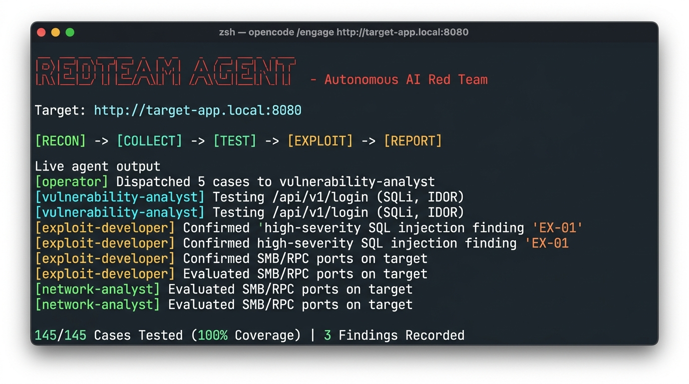
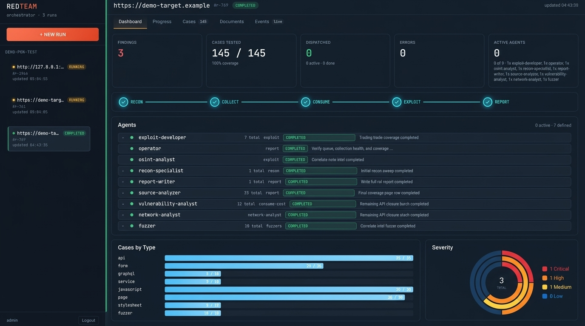
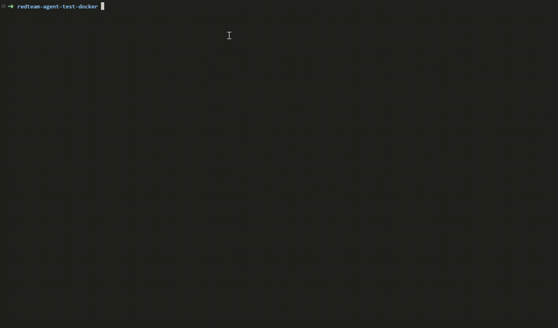

<p align="center">
  <h1 align="center">🔴 RedTeam Agent</h1>
  <p align="center">
    <strong>Autonomous AI-Powered Red Team & Penetration Testing Orchestration Framework</strong>
  </p>
  <p align="center">
    <a href="#installation">Installation</a> · 
    <a href="#quick-start">Quick Start</a> · 
    <a href="#architecture">Architecture</a> · 
    <a href="#case-collection-pipeline">Pipeline</a> · 
    <a href="#specialized-agents">Agents</a> · 
    <a href="#slash-commands">Commands</a> · 
    <a href="ABOUT.md">About</a>
  </p>
  <p align="center">
    
    
    
    
    
    
    
  </p>
</p>

---

## Overview

**RedTeam Agent** is an autonomous offensive security framework that operates directly within developer AI command-line interfaces (**[OpenCode](https://opencode.ai)**, **[Claude Code](https://docs.anthropic.com/en/docs/claude-code)**, and **[Codex](https://github.com/openai/codex)**). It transforms any workspace into a full-scale cyber operations command center for authorized penetration testing, adversary simulation, and CTF challenges.

By decoupling execution state from LLM conversational memory, RedTeam Agent pairs **9 specialized AI agent roles** with a streaming **SQLite case queue**, **containerized or bare-metal Kali Linux security tooling**, **60 offensive methodology skills**, and **79 curated security references**. It comprehensively addresses both **modern web applications** (APIs, GraphQL, SPAs, WebSockets) and **network infrastructure services** (Active Directory, Kerberos, SMB, databases, remote management), and extends into **host post-exploitation** (Linux/Windows privilege escalation, lateral movement), **cloud & container platforms** (Kubernetes, Docker, AWS/Azure/GCP), and **CI/CD pipelines**.

### Technical Documentation
* [About & Philosophy](ABOUT.md) — Motivation, design principles, and comparison matrix
* [Technical Overview](docs/OVERVIEW.md) — Comprehensive architectural specification and lifecycle mechanics
* [Bare-Metal Kali Guide](docs/baremetal-kali.md) — Running natively on Kali Linux hosts without Docker
* [Network Service Testing](docs/network-testing.md) — TCP/UDP service enumeration, parsing, and exploitation
* [Subagent Lifecycle](docs/subagent-lifecycle.md) — Engineering guidelines for agent triggers, boundaries, and evaluation

---

## Visual Demonstration

<p align="center">
  
  <br>
  <em>Autonomous CLI engagement running in OpenCode with real-time multi-agent dispatch and streaming verification.</em>
</p>

<p align="center">
  
  <br>
  <em>The local Web Orchestrator GUI visualizing run phases, event logs, 9-agent status, case queues, and findings.</em>
</p>

<p align="center">
  
</p>

---

## Key Capabilities

* **Multi-CLI Native**: Operates out of the box with OpenCode, Claude Code, and OpenAI Codex through automated install-time prompt compilation.
* **Deterministic Streaming Pipeline**: Replaces unpredictable, monolithic prompt conversations with a persistent SQLite queue (`cases.db`) and a zero-token shell dispatcher (`dispatcher.sh`).
* **9 Dedicated Agent Personas**: Operator, Recon Specialist, Network Analyst, Source Analyzer, Vulnerability Analyst, Exploit Developer, Fuzzer, OSINT Analyst, and Report Writer.
* **Dual Runtime Architecture**:
  * **Docker Containerization**: Isolates Kali tools, ProjectDiscovery suites (`katana`, `nuclei`, `subfinder`), `mitmproxy`, and Metasploit RPC in zero-setup containers.
  * **Bare-Metal Kali (`local`)**: Runs natively against local host binaries for maximum performance and direct network adapter access.
* **Unified Web & Infrastructure Scope**: Seamlessly pivots between HTTP/API testing and network protocol exploitation (SMB, LDAP, Kerberos, SSH, RDP, MSSQL, PostgreSQL).
* **Unattended Hardening**: Auto-recovers from process interruptions, enforces strict directory scoping to eliminate approval stalls, prevents duplicate findings, and validates surface coverage.
* **CTF & Lab Profile Engine**: Includes 13 ready-to-run lab profiles (Juice Shop, DVWA, WebGoat, bWAPP, HackTheBox, VulnHub, TryHackMe, Metasploitable) with objective closure verification.
* **Web Orchestrator GUI**: Optional FastAPI + React 18 control plane offering real-time WebSocket telemetry, Kanban case boards, and artifact previews.

---

## Installation

### Prerequisites
* **Operating System**: Linux or macOS (Windows/PowerShell is not supported; use WSL2).
* **At least one supported AI CLI**:
  * [OpenCode](https://opencode.ai) (`npm install -g opencode-ai`) *(Recommended)*
  * [Claude Code](https://docs.anthropic.com/en/docs/claude-code)
  * [Codex](https://github.com/openai/codex)
* **Runtime requirements**:
  * [Docker](https://docs.docker.com/get-docker/) with Docker Compose *(not required for bare-metal Kali runtime)*.
  * Base host utilities: `curl`, `jq`, `sqlite3`, `python3` (>= 3.11).

```bash
./install.sh -h
```

---

### Installation Options

#### 1. Docker All-in-One Runtime (Recommended for Isolation)
Packages OpenCode, RedTeam Agent, and the complete pentest container toolchain into an isolated, self-contained environment:
```bash
# Automated install into ~/redteam-docker
./install.sh docker ~/redteam-docker

# Launch the runtime
cd ~/redteam-docker
./run.sh
```

#### 2. OpenCode CLI
Installs canonical agent source directly into your workspace:
```bash
./install.sh opencode ~/my-redteam-agent

cd ~/my-redteam-agent
opencode
```

#### 3. Bare-Metal Kali Linux (Native Host Tools, No Docker)
Installs onto Kali Linux and validates all host pentest tools:
```bash
./install.sh kali ~/redteam-agent --install

cd ~/redteam-agent
./scripts/check_local_tools.sh
opencode
```

#### 4. Claude Code
Generates Claude subagent definitions and commands at install time:
```bash
./install.sh claude ~/redteam-claude

cd ~/redteam-claude
claude
```

#### 5. OpenAI Codex
Generates Codex agent definitions at install time:
```bash
./install.sh codex ~/redteam-codex

cd ~/redteam-codex
codex
```

---

## Quick Start

### 1. Launching an Engagement

Start your chosen CLI in your agent directory, then initiate an engagement:

```bash
# Semi-autonomous mode (prompts for proxy/cookie auth and confirms initial phase plan)
/engage http://target-app.local:8080

# Fully autonomous mode (zero user prompts, auto-skips or auto-registers auth, runs end-to-end)
/autoengage http://target-app.local:8080

# Network engagement mode (CIDR or IP range: bypasses web crawlers, activates TCP/UDP services)
/engage 10.10.10.0/24
```

### 2. Resuming an Interrupted Session

If a session is interrupted, network connection drops, or the CLI restarts, resume without data loss:
```bash
/resume
```

---

## Slash Commands

| Command | Description |
|---|---|
| `/engage <target>` | Initiates a structured engagement against a URL, IP, or CIDR block |
| `/autoengage <target>` | Runs fully autonomous end-to-end testing with zero interactive prompts |
| `/resume` | Resumes an interrupted engagement from existing disk artifacts |
| `/status` | Displays high-level phase metrics, queue state, and active agents |
| `/queue` | Shows detailed breakdown of cases across stages in `cases.db` |
| `/auth <cookie\|header>` | Injects authentication credentials or session headers into active runtime |
| `/proxy <start\|stop>` | Spawns or stops the `mitmproxy` intercepting container/process |
| `/report` | Forces compilation of the final engagement report from findings |
| `/stop` | Terminates active background containers, crawlers, and tools |
| `/confirm <auto\|manual>` | Toggles between interactive confirmation and auto-proceed mode |
| `/config [key] [value]` | Inspects or overrides engagement and crawler runtime settings |
| `/subdomain <domain>` | Triggers active and passive subdomain enumeration |
| `/vuln-analyze` | Manually prompts vulnerability analysis over accumulated artifacts |
| `/osint` | Runs passive OSINT correlation against identified hosts, emails, and technologies |
| `/recon` | Manual phase override: runs active/passive reconnaissance |
| `/scan` | Manual phase override: runs port and service scanning |
| `/enumerate` | Manual phase override: runs deep resource and directory enumeration |
| `/exploit` | Manual phase override: runs exploitation on confirmed findings |
| `/pivot` | Explores lateral movement and pivoting opportunities from compromised hosts |

---

## System Architecture

```
                                  ┌───────────────────────────────┐
                                  │           OPERATOR            │
                                  │    Strategic State Machine    │
                                  │   (Never tests targets direct)│
                                  └───┬───┬───┬───┬───┬───┬───┬───┘
                                      │   │   │   │   │   │   │
        ┌─────────────────────────────┘   │   │   │   │   │   └─────────────────────────────┐
        ▼                                 ▼   │   ▼   │   ▼                                 ▼
┌──────────────┐                 ┌──────────┐ │ ┌───┐ │ ┌───────────┐                 ┌─────────────┐
│ recon-       │                 │ source-  │ │ │vul│ │ │ exploit-  │                 │ report-     │
│ specialist   │                 │ analyzer │ │ │ana│ │ │ developer │                 │ writer      │
│ (Fingerprint)│                 │ (Static) │ │ │ly │ │ │ (Exploit) │                 │ (Report)    │
└───────┬──────┘                 └────┬─────┘ │ └───┘ │ └─────▲─────┘                 └─────────────┘
        │                             │       ▼       ▼       │
        │                             │    fuzzer  network-   │
        │                             │    (Fuzz)  analyst    │
        ▼                             ▼            (TCP/UDP)──┘
 ┌──────────────┐              ┌─────────────┐
 │  cases.db    │◄─────────────┤ intel.md    │◄─── osint-analyst
 │ (Queue State)│              │ (Secrets &  │     (Correlation)
 └──────────────┘              │  Identities)│
                               └─────────────┘
```

### The 9 Specialized Agents

1. **[`operator`](agent/.opencode/prompts/agents/operator.txt)**: Orchestrates the engagement lifecycle. Assesses state, reviews `scope.json` and `log.md`, dispatches tasks, records findings, and validates completion gates.
2. **[`recon-specialist`](agent/.opencode/prompts/agents/recon-specialist.txt)**: Performs passive and active recon (DNS, WHOIS, Wappalyzer, Nikto, Nmap, directory discovery). Re-dispatches automatically when new authentication credentials surface.
3. **[`network-analyst`](agent/.opencode/prompts/agents/network-analyst.txt)**: Specializes in non-HTTP TCP/UDP services (SMB, RPC, Active Directory, Kerberos, database listeners, SSH, RDP, DNS, SNMP, NFS).
4. **[`source-analyzer`](agent/.opencode/prompts/agents/source-analyzer.txt)**: Performs static analysis of client-side JavaScript, HTML, source maps, and API specifications to unearth hidden routes, parameters, and tokens.
5. **[`vulnerability-analyst`](agent/.opencode/prompts/agents/vulnerability-analyst.txt)**: Rapid, bounded triage agent executing 1–2 precise verification probes per vulnerability family against web endpoints.
6. **[`exploit-developer`](agent/.opencode/prompts/agents/exploit-developer.txt)**: Takes confirmed primitives (`stage=vuln_confirmed`), constructs full exploit chains, verifies operational impact, and integrates with Metasploit MCP.
7. **[`fuzzer`](agent/.opencode/prompts/agents/fuzzer.txt)**: Executes high-volume statistical fuzzing (>500 payloads) using deep SecLists dictionaries when escalated by the vulnerability analyst.
8. **[`osint-analyst`](agent/.opencode/prompts/agents/osint-analyst.txt)**: Monitors accumulated intelligence in `intel.md` via an idempotent watcher script and queries public CVEs, breach datasets, and DNS history.
9. **[`report-writer`](agent/.opencode/prompts/agents/report-writer.txt)**: Compiles structured markdown reports detailing executive risk summaries, technical vulnerability breakdowns, reproduction proofs, and remediation advisories.

---

## Case Collection Pipeline

State persistence and task routing are handled by an embedded SQLite database (`cases.db`) running under WAL mode.

```
Producers                               SQLite Queue (`cases.db`)                 Consumers
┌──────────────┐                        ┌───────────────────────┐                 ┌─ vulnerability-analyst
│ mitmproxy    ├─┐                      │ Deduplication:        │                 │  (api, form, graphql)
│ Katana       ├─┼──> [ Ingest Scripts ]│ UNIQUE(method,        ├──> dispatcher ─┼─ source-analyzer
│ recon_ingest ├─┤    (net_ingest.sh)   │  url_path,            │    (batch)      │  (javascript, page)
│ netscan.sh   ├─┘                      │  params_key_sig)      │                 ├─ fuzzer (fuzz_pending)
└──────────────┘                        └───────────────────────┘                 ├─ exploit-developer
                                                                                  └─ network-analyst (service)
```

### Stage Transitions
* `ingested`: Fresh endpoint or network service discovered by crawlers or scanners.
* `source_analyzed`: Static carrier analysis completed; newly revealed endpoints re-queued at `ingested`.
* `vuln_confirmed`: Vulnerability verified by triage; passed directly to `exploit-developer`.
* `fuzz_pending`: Complex input parameter flagged for deep wordlist fuzzing.
* `api_tested` / `clean` / `exploited` / `errored`: Terminal states.

---

## Attack Methodology Skills & References

### 60 Offensive Skills ([`agent/skills/`](agent/skills/))
* **Injection**: SQL Injection, NoSQL Injection, Command Injection, SSTI, XXE, GraphQL Injection, Prototype Pollution.
* **Authentication & Identity**: Auth Bypass, JWT Tampering, OAuth/OIDC/SAML, MFA Bypass, User Enumeration, IDOR, Session Misconfiguration, Credential Attacks.
* **Client-Side & Web**: Stored/Reflected/DOM XSS, CSRF, CORS Misconfiguration, Open Redirect, WebSockets, Web Cache Poisoning & Deception, Subdomain Takeover, Mass Assignment.
* **Architecture & Transport**: SSRF, HTTP Request Smuggling, Deserialization, Race Conditions, Business Logic Testing, File Inclusion (LFI/RFI), File Upload Abuse, WAF/Filter Evasion (`waf-evasion-testing`).
* **Infrastructure & Services**: Active Directory & Kerberos (`ldap-kerberos`), SMB/RPC (`smb-netbios`), Database Services (`database-services`), Remote Access (`remote-access-services`), Mail/DNS (`mail-dns-services`), SNMP/FTP/NFS (`snmp-ftp-nfs`), TLS/SSL (`tls-ssl-testing`), VoIP/SIP (`voip-sip-testing`), Embedded Device Admin Planes (`embedded-device-testing`), FastCGI/PHP-FPM (`fastcgi-service-testing`), Proprietary Protocol RE (`custom-protocol-reverse-engineering`).
* **Host Post-Exploitation**: Linux Privilege Escalation, Windows Privilege Escalation, Lateral Movement & Pivoting, Post-Exploitation Triage.
* **Cloud, Containers & Supply Chain**: Kubernetes, Containers & Registries, Cloud (AWS/Azure/GCP), CI/CD Pipelines.

### 79 Security References ([`agent/references/`](agent/references/))
* **OWASP Top 10 (2025 Edition)** & **OWASP API Security Top 10 (2023)**.
* **Active Directory Attack Guides**: Kerberoasting, AS-REP roasting, ADCS ESC1-ESC8 abuse, BloodHound hunting.
* **Offensive Tradecraft & Tooling**: In-depth usage guides for `sqlmap`, `hydra`, `nmap`, `ffuf`, `gobuster`, `hashcat`, and `nuclei`.

---

## Lab Profiles & Objective Verification

RedTeam Agent decouples lab-specific flags and knowledge from generic prompts via declarative JSON profiles in [`agent/labs/`](agent/labs/):

* **Supported Profiles**: `juice-shop`, `dvwa`, `webgoat`, `bwapp`, `portswigger`, `metasploitable`, `hackthebox`, `vulnhub`, `tryhackme`, `generic-web`, `generic-network`, `generic-ctf`.
* **Objective Tracking**: [`agent/scripts/lab_objective.py`](agent/scripts/lab_objective.py) automatically fingerprints the lab, extracts remote challenge scoreboards or local flag targets, tracks progress, and halts completion until all declared objectives are solved.

---

## Orchestrator Web GUI

For multi-target management and real-time visualization, RedTeam Agent includes an optional web control plane:

```bash
# Start backend and frontend (default: http://127.0.0.1:18000)
./orchestrator/run.sh

# Stop orchestrator services
./orchestrator/stop.sh
```

* **Backend**: FastAPI app with SQLite storage, real-time WebSocket feeds, run supervision, and automatic report synthesis.
* **Frontend**: React 18 SPA featuring KPI dashboards, interactive phase timelines, Kanban-style case queues, and live event telemetry.

---

## Engagement Outputs

Every run isolates all evidence and logs inside `engagements/<timestamp-target>/`:

```
engagements/20260924-target-local/
├── findings.md             # Documented vulnerabilities with PoC payloads & evidence
├── report.md               # Final comprehensive penetration testing report
├── log.md                  # Chronological timeline of operator decisions & tool logs
├── intel.md                # Captured credentials, users, tech stacks, and domain maps
├── intel-secrets.json      # Raw captured passwords, API keys, and session tokens
├── auth.json               # Active session cookies, bearer headers, and tokens
├── cases.db                # SQLite database of all evaluated endpoints & services
├── surfaces.jsonl          # Attack surface coverage ledger
├── lab-profile.json        # Resolved target lab configuration and objectives
└── scans/                  # Raw tool outputs (Nmap XML, Katana JSON, Nikto, etc.)
```

---

## Development & Contributing

### The Three-Layer Split
Contributions must respect the architecture:
1. **Repository Root**: Meta only (`install.sh`, `README.md`, `ABOUT.md`, `docs/`, `.gitignore`).
2. **`agent/`**: **Canonical runtime**. All prompts, skills, references, scripts, and docker files live here.
3. **`orchestrator/`**: Web GUI reading exclusively from `agent/`.

Install the pre-commit hook before committing:
```bash
cp agent/scripts/hooks/block-root-dup-dirs.sh .git/hooks/pre-commit
chmod +x .git/hooks/pre-commit
```

---

## Authorization & Legal Notice

> [!CAUTION]
> **FOR AUTHORIZED SECURITY TESTING ONLY**
> 
> RedTeam Agent is a powerful offensive security simulation framework. It must be operated **exclusively** on systems, applications, and networks where you have received explicit, prior written authorization from the verified owner.
> 
> Unauthorized port scanning, exploitation, or vulnerability discovery against third-party systems is strictly prohibited and violates local, federal, and international law. The developers and contributors assume no liability for misuse, damages, or unintended consequences resulting from this software.
